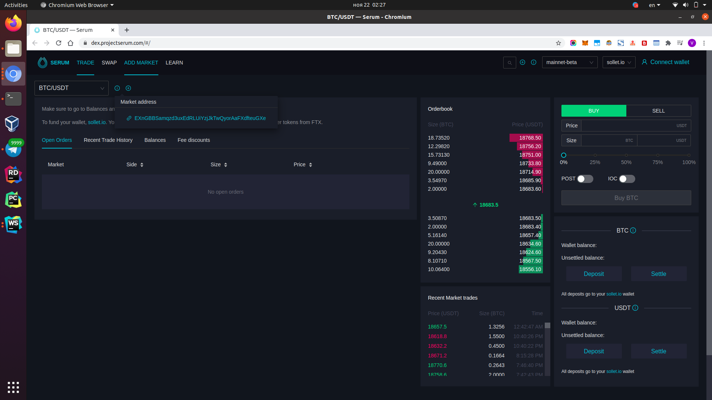

# serum-supercrane

```bash
# install nodenv
curl -fsSL https://raw.githubusercontent.com/nodenv/nodenv-installer/master/bin/nodenv-installer | bash

# install recent nodejs
/home/v/.nodenv/bin/nodenv install 14.15.1

# check
/home/v/.nodenv/versions/14.15.1/bin/node --version
/home/v/.nodenv/versions/14.15.1/bin/npm --version

# TODO switch to this version in WebStorm

# install dependencies
/home/v/.nodenv/versions/14.15.1/bin/npm i
```

## Market address



## References

про биржу - https://docs.google.com/document/d/1isGJES4jzQutI0GtQGuqtrBUqeHxl_xJNXdtOv4SdII/edit

про то как заработать - https://github.com/project-serum/rfcs/blob/master/text/0001-registry.md

the `process_requests` method - https://github.com/project-serum/serum-dex/blob/master/dex/src/matching.rs#L75
